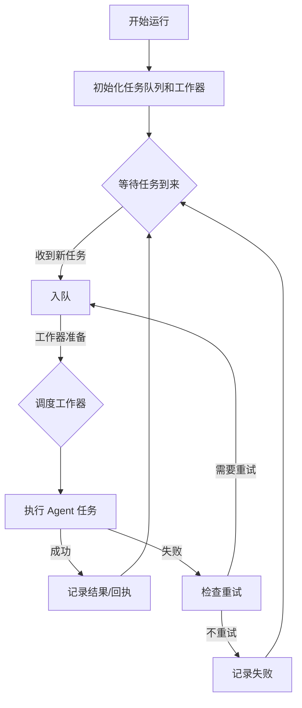

# 执行摘要

Claude Agent SDK 是一个面向生产环境的智能体开发框架，为 Python 开发者提供与 Claude Code 相同的工具、**智能体循环**（agent loop）和**上下文管理**能力【39†L114-L119】【34†L1-L4】。使用该 SDK，开发者可以让智能体自主读取文件、执行 shell 命令、搜索网络并编辑代码等，而无需手动实现这些功能【39†L114-L119】。本文深入分析 Claude Agent SDK 的内部原理与架构，全面列出其 API 接口与功能，演示安装配置和多种调用示例，并就构建基于此 SDK 的调度器工具给出设计与实现建议。报告还包括示例项目结构、接口定义表格、性能/成本估算、常见问题及安全合规注意事项，帮助开发者从零开始构建可靠的 Claude Agent 调度系统。

【39†L114-L119】【34†L1-L4】

## SDK 原理与架构

Claude Agent SDK 底层调用本地的 Claude Code 可执行文件，实现与 Claude Code 相同的**智能体循环**流程【39†L114-L119】【12†L142-L150】。具体步骤如下：SDK 接收用户提示，将系统提示、工具定义和历史对话一起发送给 Claude 模型；Claude 评估后返回一个 **AssistantMessage**，可能包含文本和零个或多个工具调用请求；SDK 并行（或顺序）执行这些工具请求，并将工具结果作为 **UserMessage** 回传给 Claude；如此迭代多个回合直至 Claude 不再发出工具调用，最终输出包含结果文本和使用统计的 **ResultMessage**【12†L142-L150】【26†L1957-L1964】。每个回合结束后，SDK 向用户代码产生相应的消息事件，方便外部观察：包括 `SystemMessage`（会话初始化/结束等元数据）、`AssistantMessage`（智能体回应）、`UserMessage`（工具执行结果）等【12†L142-L150】【26†L1957-L1964】。

- **组件**：主要提供 `query()` 函数和 `ClaudeSDKClient` 类。`query(prompt, options)` 用于发起一次新会话，并以异步迭代器方式产出消息【7†L327-L334】【7†L348-L351】。`ClaudeSDKClient` 则可重复使用保持会话状态，支持显式连接、发送多条查询、接收消息流、发送中断等功能【9†L762-L770】【10†L966-L974】。此外，SDK 通过 `@tool(name, desc, input_schema)` 装饰器让开发者定义自制工具（将函数暴露给智能体调用），并提供 `create_sdk_mcp_server(name, version, tools)` 等接口将这些工具注册到 MCP（Claude 远程过程调用协议）服务器【7†L374-L383】【7†L471-L480】。
- **数据流与生命周期**：每个智能体会话通过 SDK 的事件流完整展现其生命周期【12†L142-L150】。会话开始时，SDK 发出一个 `SystemMessage`（子类型为 `"init"`）表示初始化状态。每完成一个回合，就输出一个 `AssistantMessage` 包含 Claude 的输出以及调用到的工具列表；执行工具后又输出一个或多个 `UserMessage` 表示工具结果。最终当 Claude 无工具调用并生成最终回答时，SDK 输出 **ResultMessage**，其中包括最终文本、总轮次、代币使用和估算成本等信息【12†L155-L158】【26†L1957-L1964】。开发者可从消息流中获取进度或结果。
- **并发与状态管理**：SDK 使用异步 I/O 机制，允许在单个进程中并发运行多个 Agent 会话。开发者可利用 Python 的 `asyncio` 或 `anyio` 创建多个任务，通过 `asyncio.gather()` 等方式并行调用 `query()`。【33†L169-L177】此外，SDK 支持“**子智能体**”机制，即主智能体可在运行中动态产生多个子智能体实例进行并行处理，每个子智能体拥有独立上下文，可并行加速复杂工作流【33†L169-L177】。会话的上下文由底层存储管理，默认保存在项目目录的 `.claude/sessions` 文件中；开发者也可将会话持久化到外部存储以实现更复杂的跨会话状态管理。
- **认证与安全**：使用 Claude Agent SDK 需要进行身份验证。开发者通常获取 Claude API Key 并通过环境变量 `ANTHROPIC_API_KEY` 提供【39†L168-L176】。SDK 还支持通过 Amazon Bedrock、Anthropic AWS、Google Vertex AI、Azure Foundry 等云服务进行授权【39†L168-L176】。官方文档明确指出只能使用官方提供的授权方式，禁止第三方通过 claude.ai 登录或限制使用速率【39†L180-L183】。在功能权限上，SDK 提供了多种权限模式和钩子回调。可在 `ClaudeAgentOptions` 中设置 `permission_mode`（例如 `"acceptEdits"`）允许编辑操作，也可以使用钩子函数（如 `PreToolUseHook`、`PostToolUseHook`）动态验证、记录或阻止特定的工具调用【10†L966-L974】【10†L990-L999】。

【39†L114-L119】【12†L142-L150】【26†L1957-L1964】【39†L168-L176】

## 支持的接口与能力

Claude Agent SDK 暴露丰富的 API 和工具扩展机制，主要包括以下部分：

- **核心函数与类**：
  - `query(prompt: str, options: ClaudeAgentOptions = None, transport: Any = None) -> AsyncIterator[Message]`：异步函数，用于发起一次新智能体会话。返回一个异步迭代器，按顺序产出本次会话的各种消息（`AssistantMessage`、`UserMessage`、`StreamEvent`、`ResultMessage` 等）【7†L327-L334】【7†L348-L351】。参数包括用户提示 `prompt` 和会话配置 `options`（可指定工具列表、权限模式、提示等）。
  - `ClaudeSDKClient(options: ClaudeAgentOptions = None, transport: Any = None)`：客户端类，用于维护和重用会话上下文。常用方法包括：
    - `connect(prompt: str = None)`：启动会话并可发送初始提示。
    - `query(prompt: str, session_id: str = "default")`：在指定会话（默认 `"default"`）中发送一条新提示，返回 `None`。
    - `receive_messages() -> AsyncIterator[Message]`：异步迭代接收当前会话的消息流（包含用户、助手、系统消息等）。
    - `receive_response() -> AsyncIterator[Message]`：类似 `receive_messages`，但遇到 `ResultMessage` 时结束迭代，适用于一次对话获取最终结果。
    - `interrupt()`：发送中断信号以尝试终止当前正在执行的工具调用【10†L966-L974】。
    - `set_permission_mode(mode: str)`、`set_model(model: str)`：动态修改权限模式（如 `acceptEdits` 或 `ignoreEdits`）和使用的模型版本（如 `"claude-sonnet-4-6"`）。
    - `rewind_files(user_message_id: str)`：将文件系统回滚到指定用户消息时的状态（需启用文件检查点）。
    - `stop_task(task_id: str)`：停止指定后台任务（如 Monitor 工具创建的监视任务）并生成通知消息。
    - `disconnect()`：结束客户端会话，清理资源。
  - `ClaudeAgentOptions`：配置选项类，可定制智能体行为和环境。常用字段：
    - `allowed_tools: List[str]`：智能体可使用的工具名称。
    - `permission_mode: Literal["denyEdits","acceptEdits"]`：对文件写入等编辑操作的默认权限策略。
    - `model: str`：使用的 Claude 模型（如 `"claude-sonnet-4-6"`）。
    - `timeout_seconds: int`：超时时间。
    - `include_partial_messages: bool`：是否开启部分消息流式输出（默认为 False）。开启后会产出 `StreamEvent` 类型的增量消息【31†L122-L130】。
    - `environment: Dict[str,str]`：传递给 Claude CLI 子进程的环境变量（可控制工具搜索开关等）。
    - 其他字段如 `system_prompt`（系统提示词）、`max_turns`（最大回合数）、`max_budget_usd`（成本预算上限）等【12†L189-L197】。

- **工具与钩子**：
  - `@tool(name: str, desc: str, input_schema: dict = None, annotations: dict = None) -> Callable`: 装饰器，用于定义一个工具。被装饰的函数应返回一个 JSON 序列化的结果对象。如返回文本可形如 `{"content": "..."}`。该工具会注册到 MCP 服务，智能体可在对话中通过 “工具调用” 的方式使用它【7†L374-L383】。
  - `create_sdk_mcp_server(name: str, version: str = "1.0.0", tools: List[SdkMcpTool] = None) -> SdkMcpConfig`: 创建一个内置的 MCP 服务器配置（stdio 通信方式）。用于将自定义工具引入 SDK。通常在 `ClaudeAgentOptions.mcp_servers` 中使用，以便将工具暴露给智能体。
  - **钩子回调**：支持在智能体循环的各个阶段插入用户回调。例如：
    - `SessionStartHookInput`、`SessionEndHookInput`：会话开始和结束时触发。
    - `PreToolUseHookInput`、`PostToolUseHookInput`：每次工具调用前后触发，可用于验证或修改输入输出【10†L990-L999】。
    - `StopHookInput`：会话被中断时触发等。
    用户可通过 `ClaudeAgentOptions(hooks={...})` 注册这些钩子，返回修改后的输入输出或执行其他逻辑。【10†L990-L999】
  - **子智能体**：SDK 支持在对话中动态创建子智能体，并将执行交给它们处理。开发者可以通过 `ClaudeAgentOptions(agents=[...])` 指定多个子智能体，每个子智能体都有独立的提示和工具限制，从而实现并行处理子任务【33†L169-L177】。子智能体的调用由 Claude 在对话中通过 `Agent` 工具触发，最终结果返回给主智能体。
  - **插件**：可通过 `plugins` 配置加载本地插件包。目前仅支持类型为 `"local"` 的本地插件，每个插件指定文件系统路径【26†L1847-L1855】。
  - **工具搜索**：当可用工具列表很大时，可启用 “工具搜索” 功能（Tool Search），智能体会在需要时动态加载相关工具定义，而不是一次性加载所有定义。通过环境变量 `ENABLE_TOOL_SEARCH` 可控制此功能（默认开启）【32†L125-L134】【32†L175-L184】。
  - **流式支持**：开启 `include_partial_messages=True` 后，SDK 会输出 `StreamEvent` 类型消息，其中包含 Claude API 产生的流式事件（如 `"content_block_delta"`）【31†L122-L130】。用户需自行从 `StreamEvent.event` 字段累积文本增量以实时显示结果。

- **错误码与事件类型**：SDK 会将 API 层面的错误映射为异常或错误字段。主要异常类型有：
  - `ClaudeSDKError`：所有自定义异常的基类。
  - `CLINotFoundError`：找不到底层 Claude CLI。
  - `CLIConnectionError`：与子进程通信失败。
  - 另外，`AssistantMessage.error` 字段可能为 `"authentication_failed"`, `"rate_limit"`, `"invalid_request"` 等【26†L1928-L1936】。常见错误如鉴权失败、模型超限、网络故障等，需要在代码中捕获和处理。
  - **事件消息**：除了上面常见消息，SDK 还会在后台任务（如 Monitor 监视任务）相关事件时输出 `TaskStartedMessage`、`TaskProgressMessage`、`TaskNotificationMessage` 等系统消息，提供任务进度和通知信息。

以上接口和功能涵盖了 Claude Agent SDK 的绝大部分能力，包括扩展点（工具、子智能体、钩子）、异步流式输出和多种消息类型。开发者可参考官方文档进一步了解每个方法的详细参数和返回结构。

【7†L327-L334】【31†L122-L130】【26†L1928-L1936】【33†L169-L177】

## 使用方法

在 Python 项目中使用 Claude Agent SDK 的主要步骤包括安装、配置认证，以及编写调用代码。下面以实用示例说明常见用法。

1. **安装 SDK**：确保环境为 Python 3.10 或更高版本【39†L114-L119】【3†L100-L104】。在项目目录下执行：
   ```bash
   pip install claude-agent-sdk
   ```
   安装完成后，可通过 `import claude_agent_sdk` 使用库。该包会自动下载适合当前平台（Windows/Linux/macOS）的底层二进制【39†L156-L163】【3†L100-L104】。

2. **配置认证**：获取 Claude API Key，并设置为环境变量 `ANTHROPIC_API_KEY`【39†L168-L176】。如果使用 Anthropic 平台提供的企业账户，设置后即可使用。若在 AWS、Bedrock、Vertex AI 等环境部署，需相应设置：
   - Amazon Bedrock：`export CLAUDE_CODE_USE_BEDROCK=1` 并确保 AWS 凭证可用【39†L168-L176】。
   - Claude AWS 服务：设置 `CLAUDE_CODE_USE_ANTHROPIC_AWS=1` 及 `ANTHROPIC_AWS_WORKSPACE_ID`【39†L168-L176】。
   - Vertex AI：`export CLAUDE_CODE_USE_VERTEX=1`。
   - Azure Foundry：`export CLAUDE_CODE_USE_FOUNDRY=1`。
   
   注意仅使用授权方式进行登录；官方明确指出，不得使用 claude.ai 界面登录或绕过 API 调用授权【39†L180-L183】。

3. **示例代码**：
   - **同步调用示例**：下面示例使用 `asyncio.run` 发起异步会话，每当有新消息时打印出来，最终输出结果文本。
     ```python
     import asyncio
     from claude_agent_sdk import query, ClaudeAgentOptions

     async def run_agent():
         options = ClaudeAgentOptions(
             allowed_tools=["Read", "Bash", "Write"],
             permission_mode="acceptEdits",
         )
         async for message in query(
             prompt="列出项目目录中的所有 Python 文件",
             options=options
         ):
             # 打印交互中的所有消息
             print(message)
             if hasattr(message, "result"):
                 print("最终结果:", message.result)

     asyncio.run(run_agent())
     ```
     该示例中，Agent 会使用 `Glob` 和 `Read`（通过 `Bash` 或 `Write`）等工具读取文件列表，最后打印结果【39†L114-L119】。

   - **异步流式输出示例**：启用部分消息流，实时获取文本输出。将 `include_partial_messages=True` 添加到选项中：
     ```python
     import asyncio
     from claude_agent_sdk import query, ClaudeAgentOptions
     from claude_agent_sdk.types import StreamEvent

     async def stream_agent():
         options = ClaudeAgentOptions(
             allowed_tools=["Read"],
             include_partial_messages=True
         )
         async for message in query(
             prompt="写一首有关春天的诗并逐字输出",
             options=options
         ):
             if isinstance(message, StreamEvent):
                 event = message.event
                 if event.get("type") == "content_block_delta":
                     delta = event.get("delta", {})
                     if delta.get("type") == "text_delta":
                         text = delta.get("text", "")
                         print(text, end="", flush=True)

     asyncio.run(stream_agent())
     ```
     这段代码会逐字地打印 Claude 生成的诗句，因为它每接收到一个 `StreamEvent`（内容增量）就输出对应文本【31†L122-L130】。

   - **调度器任务队列示例**：在调度场景中，通常需要同时处理多个任务。下面示例使用 `asyncio.Queue` 和多个工作协程来分发任务，并行运行多个 Agent 会话：
     ```python
     import asyncio
     from claude_agent_sdk import query, ClaudeAgentOptions

     async def agent_worker(queue):
         while True:
             task = await queue.get()
             if task is None:
                 queue.task_done()
                 break
             prompt, tools = task
             print(f"开始任务：{prompt}")
             async for message in query(prompt=prompt, options=tools):
                 if hasattr(message, "result"):
                     print(f"任务结果：{message.result}")
             queue.task_done()

     async def main():
         # 构建任务列表，包含提示词和选项
         tasks = [
             ("审查 my_script.py 中的注释", ClaudeAgentOptions(allowed_tools=["Read", "Grep"])),
             ("运行测试套件", ClaudeAgentOptions(allowed_tools=["Bash"])),
             ("检查 TODO 并生成报告", ClaudeAgentOptions(allowed_tools=["Read", "Glob"]))
         ]
         queue = asyncio.Queue()
         for t in tasks:
             queue.put_nowait(t)
         # 启动并发工作器
         workers = [asyncio.create_task(agent_worker(queue)) for _ in range(3)]
         await queue.join()  # 等待所有任务完成
         # 停止工作器
         for _ in workers:
             queue.put_nowait(None)
         await asyncio.gather(*workers)

     asyncio.run(main())
     ```
     在此示例中，我们创建了一个包含三条任务的队列，并启动三个 `agent_worker` 协程。每个协程从队列获取任务并调用 `query()` 运行 Agent，会话完成后打印输出结果。这展示了如何简单地设计一个基于队列的并发调度系统。

4. **CLI 使用**：除了编程接口，Claude Code 自带 `claude` CLI 工具，可在终端以交互或脚本方式运行 Agent。若不使用 Python SDK，也可编写脚本通过 `subprocess` 调用 `claude -p` 等命令实现相似功能。这在某些部署场景（如 cron 定时）中也很有用。

【39†L156-L163】【31†L122-L130】

## 设计与实现建议

在设计一个基于 Claude Agent SDK 的任务调度器时，应综合考虑可靠性、并发性能和资源成本等多方面因素。以下是一些关键建议：

- **调度器架构**：采用生产者-消费者（Producer-Consumer）模式。中央调度器维护任务队列，将任务分发给多个工作者（worker）并发执行。在 Python 中，可使用 `asyncio.Queue` 或第三方队列系统（如 RabbitMQ、Redis）实现任务调度。下图示意了一个典型调度流程：  



- **任务分配**：根据任务优先级和可用资源将任务分配给空闲工作器。对于高优先级任务可选择先调度。可以实现多个队列或优先级队列来管理不同类别任务。
- **重试策略**：网络或模型调用失败时进行重试。例如捕获 `ClaudeSDKError` 异常后，等待指数退避时间再重新放入队列。可设置最大重试次数以避免无限循环。对于可幂等任务，可增加状态标记或持久化防止重复处理【15†L301-L309】。
- **并发控制**：限制同时运行的 Agent 会话数以保护系统资源。可以使用 `asyncio.Semaphore` 或配置工作器数量控制并发度，并监测 CPU、内存使用率。对于大规模部署，可使用多个独立进程或容器来分散负载，每个单元维持一部分并发会话。
- **资源限制**：针对单个会话可配置 `max_turns`（最大工具调用回合数）和 `max_budget_usd`（成本预算）来限制运行时间和费用【12†L189-L197】。调度器级别可设置每个任务的超时限制，超时后中断会话并记录警告。
- **监控与日志**：记录每次任务的开始、结束时间、耗时及结果。可在 `SessionStart` 和 `SessionEnd` 钩子中埋点日志。使用 OpenTelemetry 等监控方案追踪任务流程和延迟【19†L172-L181】。将日志输出到集中式系统（如 ELK 或云监控）以便实时监控和报警。
- **测试策略**：首先在本地环境对各个组件进行单元测试。例如模拟一个简单的任务队列，使用固定输出的 “假 Claude” 替代实际模型；或者编写 mock 函数返回预定结果。进行端到端测试时，可针对边界情况（高并发、长运行、工具失败）进行压力测试，确保调度器的健壮性。

总之，调度器设计应兼顾可维护性和可扩展性，通过合理的队列策略、并发控制和错误处理，构建稳定的任务执行环境。上述流程图、设计思想可作为实现 Claude Agent 调度工具的参考蓝图。

## 示例工程结构与关键接口

以下是一个基于 Claude Agent SDK 的调度工具示例工程结构及其关键模块接口定义：

```
agent_scheduler/                # 项目根目录
├── main.py                    # 应用入口，启动调度器
├── scheduler.py               # 调度器逻辑（任务队列管理、工作器创建）
├── worker.py                  # 工作器逻辑（执行 Claude 查询）
├── tasks.py                   # 任务定义（Task 类，参数校验等）
├── config.py                  # 配置文件（并发数、超时等全局设置）
├── utils/
│   ├── logger.py              # 日志初始化和辅助函数
│   └── helpers.py             # 通用功能（如重试装饰器）
└── requirements.txt           # 依赖列表
```

关键模块和函数接口如下表所示：

| 模块/函数             | 参数                                      | 返回值                 | 异常                          |
| --------------------- | ----------------------------------------- | ---------------------- | ----------------------------- |
| `scheduler.start()`   | `tasks: List[Task]` 任务列表<br>`concurrency: int` 并发工作者数 | `None`（阻塞执行直到所有任务完成） | `RuntimeError`（任务队列故障） |
| `scheduler.stop()`    | 无                                        | `None`                 | 无                            |
| `worker.run(task: Task) -> str` | `task: Task`（包含提示词和选项） | `str`（Agent 生成的最终文本结果） | `ClaudeSDKError`（智能体执行错误） |
| `tasks.Task` 类     | `prompt: str` 提示文本<br>`options: ClaudeAgentOptions` 会话选项 | `Task` 实例             | `ValueError`（参数非法）       |
| `config.get_options() -> ClaudeAgentOptions` | 无                     | `ClaudeAgentOptions` 配置对象 | 无                            |
| `utils.logger.setup(file_path: str) -> logging.Logger` | 日志文件路径            | Python `Logger` 实例    | `FileNotFoundError`（无效路径） |

该示例工程中，`main.py` 调用 `scheduler.start()` 并传入任务列表和并发度。`scheduler.py` 负责初始化队列、启动工作协程和汇总结果。`worker.py` 包含 `run()` 函数，用于调用 `claude_agent_sdk.query()` 执行智能体任务并处理消息流。`tasks.py` 定义了 `Task` 类用于封装任务信息。表格列出了主要模块的函数接口、输入输出和可能抛出的异常，便于团队协作时明确职责分工。

## 兼容性与依赖

- **Python 版本**：Claude Agent SDK 要求 Python 3.10 及以上版本【39†L114-L119】【3†L100-L104】。官方测试环境包括 Python 3.10–3.13，建议使用最新的稳定版。
- **操作系统**：支持主流操作系统（Linux、macOS、Windows）。安装时会下载对应平台的底层可执行文件【39†L156-L163】【3†L100-L104】。Windows 环境需确保 64 位/32 位 Python 与操作系统匹配。
- **第三方库**：主要依赖 `claude-agent-sdk`（包含内置依赖）。运行示例需要 `asyncio`（Python 标准库）和可选的 `anyio`。如果项目引入了任务队列或监控，还可能包含 `aiofiles`、`uvloop`、`aioredis`、`opentelemetry` 等。
- **部署环境**：可部署在裸机、虚拟机、容器（Docker）或无服务器环境中。对于大型并发，可考虑使用容器编排（如 Kubernetes）扩展实例。若使用云平台，确保环境变量配置正确，并授予必要的网络/安全权限访问 Claude 服务。

【39†L156-L163】【3†L100-L104】

## 性能与成本估算

Agent SDK 的性能取决于模型响应时间和任务并发度，成本取决于 token 用量和定价策略。

- **吞吐与延迟**：一次完整的 Agent 会话延迟包括本地启动、网络通信和 Claude 推理时间，通常在几秒至十几秒级别。实际吞吐量受限于模型响应速度和 API 并发限额。比如每次调用平均消耗 1000-2000 个令牌，使用 Claude Sonnet 4.6 的话（输入 $3/百万 tokens，输出 $15/百万 tokens）【21†L169-L173】。如果一个会话输入 1500 tokens、输出 800 tokens，则成本约为 `(1500/1e6)*3 + (800/1e6)*15 ≈ $0.003 + $0.012 = $0.015`。
- **并发数**：假设每天处理 500 次此类任务，总成本约 $7.5。实际并发可根据需求灵活调整，例如部署 5 个并发工作者并行执行任务。需要注意 API 的每分钟请求量（RPM）和每分钟令牌量（TPM）限制，建议参考官方给出的团队限额指导【19†L172-L181】来设定阈值。例如，较小团队可申请 200k TPM。
- **计费影响**：Anthropic 为订阅用户提供每月专用的 Agent SDK 使用额度【39†L168-L176】【17†L61-L69】。不同订阅级别每月额度从 $20（Pro）到 $200（Enterprise 高级）不等【17†L61-L69】。超出额度后，额外使用将根据 API 收费速率扣费。举例：Pro 用户每月 $20 额度，使用 Claude Sonnet 4.6 约可执行 `(20 / 0.015) ≈ 1333` 次上述任务。使用更大模型（如 Opus）费用会更高。按需部署时，若预计超出配额，可考虑使用按量付费 API Key 方式。
- **示例计算**：假设一个调度器每天处理 1000 个任务，每个任务平均消耗 2000 tokens（混合输入+输出），使用 Sonnet 4.6（平均$9/百万 tokens），则每日成本约 `(2000/1e6)*9 * 1000 ≈ $18`，一个月约 $540。若在 Pro 订阅下，每月仅有 $20 额度，显然远不足以覆盖，此时需要支付额外费用或优化模型使用。可通过简化任务提示、控制对话长度或使用更便宜模型来降低成本。

【21†L169-L173】【17†L61-L69】

## 常见问题与调试技巧

- **身份验证错误**：确保正确设置了环境变量 `ANTHROPIC_API_KEY` 或相应云平台变量。鉴权失败通常会抛出 `ClaudeSDKError("authentication_failed")`，检查密钥是否有效且格式正确【26†L1928-L1936】。
- **CLI 未找到**：如果报 `CLINotFoundError`，可能是安装失败或平台不受支持。尝试更新 `claude-agent-sdk` 包或检查网络连通性，确保安装时能下载二进制文件【39†L156-L163】。
- **异步运行问题**：SDK 是基于 `anyio` 的异步库，官方建议使用 `anyio.run()` 来启动，但使用 `asyncio.run()` 通常也有效【22†L1-L8】。切勿在迭代消息时过早 `break`，应让流式迭代正常结束；中断后应调用 `receive_response()` 清空缓存，否则旧会话消息可能影响后续调用【10†L966-L974】。
- **工具调用被阻止**：若智能体提示工具不可用，检查 `allowed_tools` 列表是否包含所需工具。编辑类操作还受 `permission_mode` 限制，默认模式可能拒绝写入，此时需显式开启 `acceptEdits` 或在钩子中允许【10†L990-L999】。
- **流式输出丢失**：使用流式时要正确处理 `StreamEvent`。它仅包含增量数据，需要代码累积输出。不要误将 `StreamEvent` 当成完整消息。
- **会话状态异常**：如果会话未按预期结束，检查是否触发了最大轮次或超时限制（在 `ResultMessage.subtype` 中检查停止原因）。还可在 `SessionEnd` 钩子中记录日志，帮助定位异常中断。
- **版本兼容性**：使用最新的 SDK 和 CLI 版本以获得最佳兼容性和性能。多次迭代之后版本会更新，保留环境锁定同一版本可避免突发兼容问题。

以上调试建议和常见问题可帮助快速定位和解决在开发调度工具时遇到的问题。

【39†L156-L163】【10†L966-L974】

## 安全与合规注意事项

- **授权方式**：只使用官方支持的认证方式（API Key、Bedrock/Vertex/Azure 等云环境认证），不得使用非公开途径登录 Claude【39†L180-L183】。妥善管理密钥和凭证，不要在代码中硬编码。
- **权限控制**：为智能体设置最小必要权限。对写操作等高风险工具使用严格的钩子验证或限制。利用 `permission_mode` 和钩子回调确保智能体无法随意删除或修改重要文件。
- **数据隔离**：智能体会话可能处理用户代码或机密信息，应确保对话记录和日志的存储安全。避免将敏感数据暴露给不受信任的第三方库或网络环境。
- **审计日志**：记录智能体执行过程中的关键操作（工具调用、批准结果、错误信息），便于事后审计。可以在 `PostToolUse` 钩子中日志化工具使用细节【10†L990-L999】。
- **依赖安全**：定期更新 SDK 到最新版本，利用厂商安全补丁。仅信任官方发布的包源进行安装。
- **监管合规**：若在受监管领域（如金融、医疗）使用 Agent，确保模型输出符合规定，可考虑引入人工审批环节。记录智能体决策过程，以备合规审计。

综合以上，在构建基于 Claude Agent SDK 的调度系统时，需要在方便开发的同时，始终保持严谨的安全控制和合规措施。

【39†L180-L183】【10†L990-L999】

## 参考文献

- Claude Agent SDK 官方文档与示例【39†L114-L119】【12†L142-L150】【31†L122-L130】【26†L1928-L1936】  
- AWS 官方博客：“Claude Agent SDK 生产级部署”【39†L168-L176】【39†L180-L183】  
- Anthropic Support：“使用 Claude Agent SDK 与订阅计划”【39†L168-L176】  
- GitHub 讨论：“Agent 调度/守护模式”【15†L301-L309】  
- Claude 定价与使用指南【21†L169-L173】【17†L61-L69】