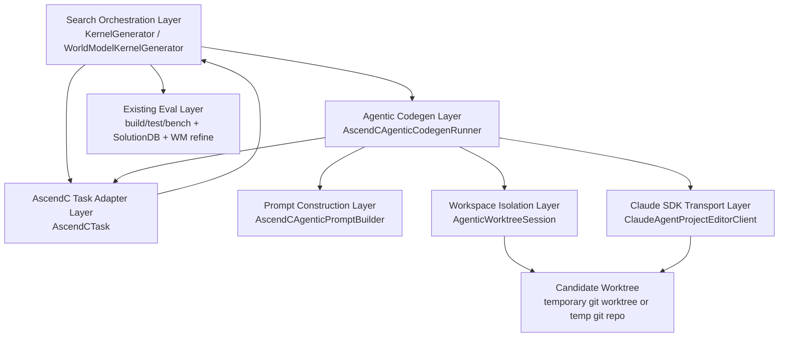
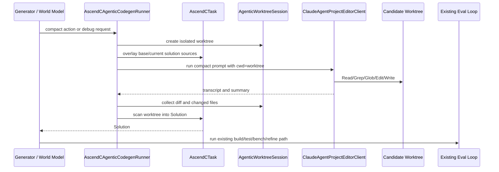

# AscendC Agentic Worktree Codegen Design

Date: 2026-05-25

Status: Approved for implementation planning

## Goal

K-Search currently times out in AscendC Claude runs because code generation prompts can contain full project source containers, current code, best code, world-model sections, and logs. The current Claude Agent SDK wrapper uses `query()` as a prompt-to-text backend, with no project `cwd` and no file tools, so K-Search has to put all useful code context into one long prompt.

This design changes Claude+AscendC codegen from "send a long prompt and parse returned code text" to "create an isolated project worktree, give Claude a compact task, let Claude read and edit files on demand, then scan the edited project into a K-Search `Solution`."

## Selected Approach

Use Agentic Worktree Codegen for `llm_provider == "claude-agent"` and `language == "ascendc"` by default.

Key decisions:

- Claude+AscendC defaults to the new agentic path.
- Other providers and languages keep the existing prompt-to-text path.
- Claude edits files directly in an isolated candidate worktree.
- K-Search scans the edited project directory to build `Solution.sources`.
- A temporary git worktree is used when `task_path` is inside a git repository.
- A temporary copied git repository is used as fallback when `task_path` is not inside a git repository.
- First implementation stage does not include MCP tools, subagents, Claude Bash, or agent-run build/test/bench.

## Architecture



K-Search remains the search system. Claude becomes a project editor for one candidate attempt.

The existing loop still owns:

- World-model initialization, action selection, cycle control, and refinement.
- Best solution tracking.
- SolutionDB persistence.
- Build, correctness, and benchmark execution.
- Failure classification after evaluation.

The new agentic path owns only one thing: turning a compact codegen intent into edited files in a candidate worktree.

## Module Responsibilities

| Module | Single responsibility | Explicit non-responsibilities |
| --- | --- | --- |
| `KernelGenerator` / `WorldModelKernelGeneratorWithBaseline` | Decide when to invoke agentic AscendC codegen and keep the search loop moving | Does not create worktrees, set Claude SDK options, scan files, or build prompts inline |
| `AscendCTask` | Provide AscendC project adapter behavior: source file selection, solution overlay, and solution creation from a project directory | Does not call Claude or know SDK transport details |
| `AscendCAgenticCodegenRunner` | Orchestrate one agentic codegen attempt from request to `Solution` | Does not contain git implementation details, SDK options, or source file filtering rules |
| `AscendCAgenticPromptBuilder` | Build compact prompts from spec, chosen action, debug context, eval summary, and safety rules | Does not read files, call Claude, or create directories |
| `AgenticWorktreeSession` | Create, baseline, diff, preserve, and clean an isolated git-backed worktree | Does not know about Claude, prompts, benchmark status, or world models |
| `ClaudeAgentProjectEditorClient` | Call Claude Agent SDK with `cwd`, tools, permissions, timeout, and transcript collection | Does not know AscendC, scan final files, or generate `Solution` objects |

The `AscendCAgenticCodegenRunner` is allowed to coordinate other components. It should not inline their implementation details.

## Data Flow



Control context stays compact:

- Compact task definition.
- Chosen world-model action or debug intent.
- Last eval summary.
- Relevant trace excerpt.
- Target GPU and round metadata.
- File access and minimal-edit rules.

Code context moves through files:

- Baseline task files are placed in the candidate worktree.
- Parent or current solution sources are overlaid into the worktree.
- Claude reads project files as needed through SDK file tools.
- Claude edits only necessary files.
- K-Search scans final project sources into `Solution.sources`.

## Worktree Lifecycle

When `task_path` is inside a git repository:

```text
git worktree add <tempdir> <repo HEAD>
overlay current or parent solution sources into <tempdir>
git add -A
git commit -m "ksearch agentic baseline"
run Claude with cwd=<tempdir>
collect git diff HEAD
scan source files into Solution
cleanup worktree unless preservation is requested
```

When `task_path` is not inside a git repository:

```text
copy task_path to <tempdir>
git init
git add -A
git commit -m "ksearch task baseline"
overlay current or parent solution sources
git add -A
git commit -m "ksearch agentic baseline"
run Claude with cwd=<tempdir>
collect git diff HEAD
scan source files into Solution
cleanup temp repo unless preservation is requested
```

The overlay step ensures Claude edits the same candidate state that K-Search intends to optimize. The baseline commit makes `git diff HEAD` represent only Claude's changes for that attempt.

## Claude SDK Configuration

The first-stage client uses the Agent SDK as a project editor, not as a long-prompt completion backend.

Options:

- `cwd=<candidate worktree>`
- `allowed_tools=["Read", "Grep", "Glob", "Edit", "Write"]`
- `disallowed_tools=["Bash"]`
- `permission_mode="acceptEdits"`
- `model=<configured Claude model>`
- `max_turns=<env-configured or default budget>`
- `thinking` follows existing environment behavior unless explicitly enabled

Production agentic codegen uses `ClaudeSDKClient` for controlled project-editing sessions. Tests use a client-like mock with the same session surface. The existing `query()` prompt-to-text wrapper remains available for non-agentic paths only.

## Prompt Policy

Agentic codegen prompts must not include full project source containers.

Allowed prompt content:

- Compact task specification.
- Chosen action node text.
- Debug intent for attempts after the first.
- Last eval summary and short trace excerpt.
- Previous changed-file summary when available.
- Safety rules and output instructions.

Disallowed prompt content:

- Full `<ascendc_project>` containers.
- Full current code for all files.
- Full best-so-far code.
- Full world-model JSON or long rendered world-model sections.
- Long build logs.

The prompt should instruct Claude to:

- Start with `Glob`, `Grep`, and `Read` to locate relevant files.
- Edit only necessary files.
- Preserve public entry points, host tiling contract, correctness harness behavior, and build layout.
- Avoid `.git/`, build directories, caches, generated logs, and large artifacts.
- Return a concise summary and changed-file list.

## Prompt Budget Guard

Add a hard guard for agentic codegen prompts.

Default:

- `KSEARCH_AGENTIC_PROMPT_MAX_CHARS=20000`

Behavior:

- If the compact prompt exceeds the limit, fail before calling Claude.
- The error names the largest prompt sections so the next change can reduce the right source.
- Existing prompt char logging remains.
- Agentic path logs `prompt_chars`, `prompt_lines`, `worktree_path`, `changed_files`, and diff path when available.

## Error Handling

### Claude SDK or provider failure

- Preserve existing authentication failure behavior.
- Preserve timeout behavior through `KSEARCH_LLM_TIMEOUT_SECONDS`, `CLAUDE_AGENT_TIMEOUT_SECONDS`, or `API_TIMEOUT_MS`.
- Fatal provider errors stop immediately.
- Non-fatal codegen errors can flow into existing retry or world-model failure handling.

### No file changes

- If `git diff --quiet HEAD` reports no changes, treat the attempt as `codegen_failed`.
- Include prompt chars and transcript summary in the failure.
- Do not silently reuse the previous solution as a new candidate.

### Illegal changed files

- Diff paths are validated before building a `Solution`.
- If Claude modifies `.git/`, build directories, cache directories, logs, or other forbidden paths, the attempt fails before `Solution` creation.
- Unmodified non-source files are ignored during source scanning.

### Worktree failure

- If real git worktree creation fails, fallback to copied temp git repo.
- Cleanup failures produce warnings and do not invalidate an already-created `Solution`.
- `KSEARCH_KEEP_AGENTIC_WORKTREES=1` preserves worktrees for inspection.

### Build or correctness failure

- Existing `AscendCTask.run_benchmark()` continues to classify compile, correctness, benchmark, and pass results.
- Later debug attempts receive compact summaries, not full source code.
- Existing world-model cycle and stagnation logic decides whether an action is too hard.

## Fallback Policy

Default behavior:

- Claude+AscendC uses agentic codegen.
- Agentic codegen failure becomes a codegen failure for the current attempt.
- It does not automatically fall back to the old long-prompt path.

Escape hatch:

- `KSEARCH_ASCENDC_AGENTIC_FALLBACK=legacy` enables legacy prompt-to-text fallback after an agentic codegen failure.
- No CLI fallback flag is included in the first implementation stage. Add one only in a later design if users need command-line control beyond the environment variable.

## Testing Strategy

### Claude SDK transport tests

- Verify `cwd`, allowed tools, disallowed tools, permission mode, model, and timeout are passed to SDK options.
- Verify transcript/result extraction.
- Verify auth and timeout failures preserve existing semantics.
- Verify prompts do not contain full `<ascendc_project>` containers.

### Worktree tests

- Git-backed `task_path` creates a temporary worktree.
- Non-git `task_path` falls back to copied temp git repo.
- Current solution overlay creates a baseline commit.
- Mock file edits appear in `git diff HEAD`.
- Preservation env keeps the directory.
- Cleanup removes temporary worktrees by default.

### AscendC task adapter tests

- `make_solution_from_project_dir()` scans valid source files.
- Build directories, `.git/`, caches, and logs are excluded.
- Parent solution sources override baseline files in the worktree.
- Illegal changed paths are rejected.

### Generator integration tests

- `llm_provider=claude-agent` and `language=ascendc` invokes agentic codegen.
- Mock Claude edits a file in `cwd`; final `Solution` contains edited content.
- Agentic prompts stay compact and omit full source containers.
- OpenAI, Triton, CUDA, MLX, and legacy AscendC paths remain unchanged.

### Prompt budget tests

- A large AscendC project does not cause agentic prompts to include full source files.
- Prompt size stays below the default budget for representative requests.
- Oversized compact context fails with a section-aware error.

### Documentation and CLI tests

- README documents Claude+AscendC agentic default behavior.
- README documents worktree isolation, no Bash, prompt budget, and preservation env.
- CLI help documents any new flags added during implementation.

## Acceptance Criteria

- Claude+AscendC codegen no longer sends full project source containers in prompts.
- Claude can edit files inside an isolated worktree using file tools.
- K-Search can scan the edited worktree into a valid AscendC `Solution`.
- Existing benchmark and world-model refinement flows still work after the solution is created.
- Logs show prompt size, worktree path, changed files, and diff location.
- Non-Claude and non-AscendC behavior remains unchanged.
- Tests cover SDK options, worktree lifecycle, source scanning, prompt budget, and generator routing.

## Out Of Scope

- MCP tools for build, correctness, benchmark, or last eval summary.
- Claude Bash access.
- Claude-driven build/test/bench loops.
- Programmatic subagents for locator/editor separation.
- Replacing existing AscendC patch parsing in legacy mode.
- Changing CUDA, Triton, MLX, or OpenAI-compatible provider behavior.

## Implementation Planning Notes

Implementation should be split so each module remains independently testable:

- First add tests and abstractions for worktree lifecycle.
- Then add task adapter hooks for project-dir to solution conversion.
- Then add Claude SDK project editor client with mock support.
- Then route Claude+AscendC generator calls through the runner.
- Finally update README and CLI/environment documentation.

After this design is reviewed, the next step is to write an implementation plan with the `superpowers:writing-plans` skill.
