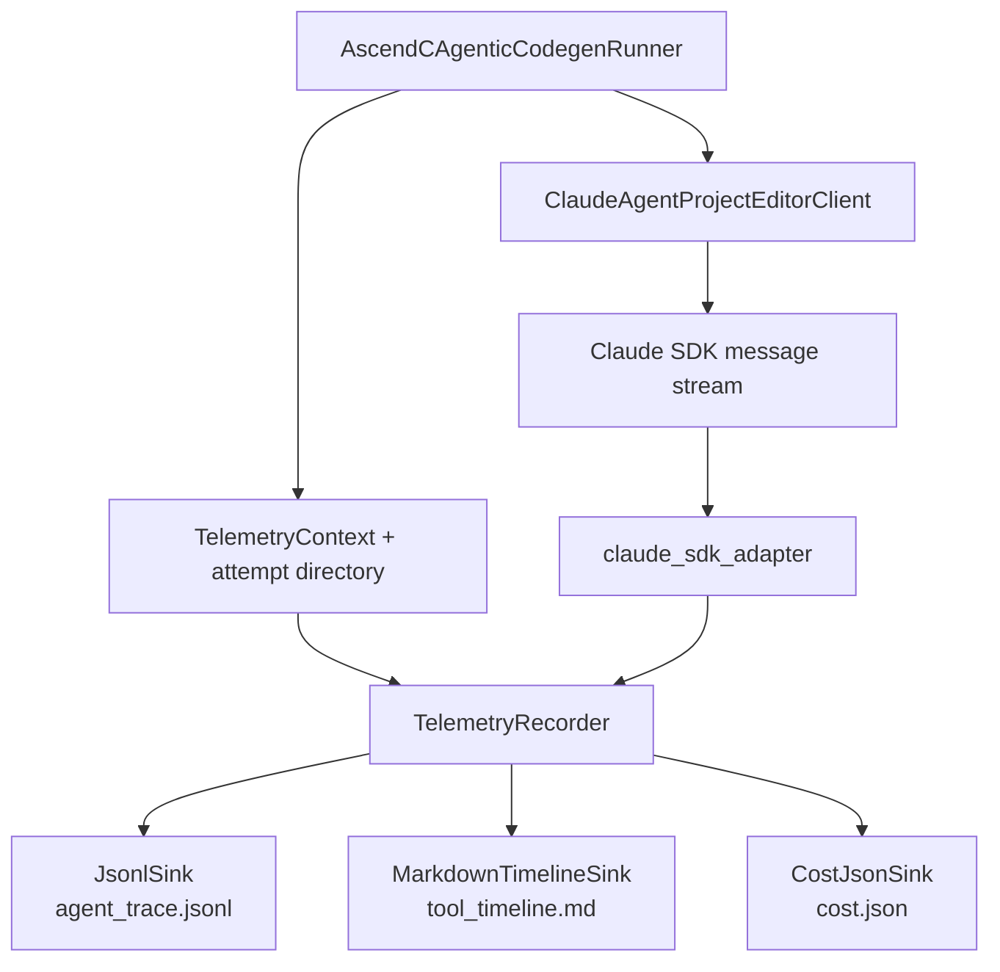

# LLM Runtime Observability Phase 1 Design

Date: 2026-05-26

Status: Approved for implementation planning

## Goal

K-Search's Claude agentic AscendC codegen path currently preserves the final
transcript, changed paths, diff text, project path, and final solution. That is
enough to know what changed, but not enough to understand how Claude reached the
change, which tools it used, whether tool calls failed, how many turns it took,
or what the attempt cost.

Phase 1 adds a small telemetry sidecar for Claude Agent SDK project-editing
attempts. It records a runtime trace, a readable tool timeline, and one attempt
cost summary without changing the core `Task`, `Solution`, or `EvalResult`
semantics.

## Selected Approach

Use a minimal sidecar integration for `ClaudeAgentProjectEditorClient`.

Key decisions:

- Add a new `k_search.telemetry` package with context, event, recorder, sink,
  cost, and Claude SDK adapter modules.
- Integrate only the Claude agentic project editor path in Phase 1.
- Keep telemetry best-effort. Any telemetry failure must not affect codegen.
- Keep business modules independent from Claude SDK block details.
- Preserve existing prompt/response logging through `_log_llm_interaction()`.
- Emit JSONL for machines, Markdown for humans, and pretty JSON for costs.

Deferred to later phases:

- OpenAI-compatible `generate()` telemetry.
- Claude `query()` prompt-to-text telemetry.
- Run-level `cost_summary.json`.
- `AttemptRecord`, failure classification, postmortem, and lesson mining.
- Budget policy and runtime cost gates.
- Web dashboard or OpenTelemetry backend.

## Architecture



The runner owns attempt context and artifact paths. The editor client owns the
SDK session and transcript extraction. The adapter owns message-to-event
conversion. The recorder and sinks own persistence.

## Module Responsibilities

| Module | Responsibility | Non-responsibilities |
| --- | --- | --- |
| `k_search.telemetry.context` | Define `TelemetryContext`, path-safe context helpers, and run id defaults | Does not write files or inspect SDK messages |
| `k_search.telemetry.events` | Define `TelemetryEvent` and safe serialization helpers | Does not know output paths |
| `k_search.telemetry.claude_sdk_adapter` | Convert Claude SDK messages and content blocks into telemetry events | Does not write artifacts or build transcripts |
| `k_search.telemetry.recorder` | Merge context into events, keep an in-memory event list, fan out to sinks, and close sinks safely | Does not understand Claude SDK details |
| `k_search.telemetry.sinks` | Write JSONL, Markdown timeline, prompt, and cost summary artifacts | Does not call LLM providers |
| `ClaudeAgentProjectEditorClient` | Emit lifecycle events and pass SDK messages through the adapter while preserving existing transcript behavior | Does not format timeline files or compute attempt paths |
| `AscendCAgenticCodegenRunner` | Build context, create a recorder, pass it to the editor, and propagate telemetry references to result objects | Does not parse Claude tool blocks |

## Data Structures

`TelemetryContext` describes where an LLM attempt belongs:

```python
@dataclass(frozen=True)
class TelemetryContext:
    run_id: str | None = None
    task_name: str | None = None
    definition: str | None = None
    flow: str | None = None
    stage: str | None = None
    round_index: int | None = None
    attempt_index: int | None = None
    action_node_id: str | None = None
    action_title: str | None = None
    model_name: str | None = None
    provider: str | None = None
    target_gpu: str | None = None
    language: str | None = None
    extra: dict[str, Any] | None = None
```

`TelemetryEvent` is the append-only event model:

```python
@dataclass
class TelemetryEvent:
    event_id: str
    ts_ms: int
    event_type: str
    context: dict[str, Any]
    provider: str | None = None
    model_name: str | None = None
    session_id: str | None = None
    raw_type: str | None = None
    tool_use_id: str | None = None
    tool_name: str | None = None
    tool_input: dict[str, Any] | None = None
    tool_result_excerpt: str | None = None
    text_excerpt: str | None = None
    is_error: bool | None = None
    usage: dict[str, Any] | None = None
    model_usage: dict[str, Any] | None = None
    total_cost_usd: float | None = None
    duration_ms: int | None = None
    duration_api_ms: int | None = None
    num_turns: int | None = None
    stop_reason: str | None = None
    error_type: str | None = None
    error_message: str | None = None
```

`TelemetryArtifacts` keeps artifact references grouped:

```python
@dataclass(frozen=True)
class TelemetryArtifacts:
    trace_path: str | None = None
    timeline_path: str | None = None
    cost_path: str | None = None
```

`ClaudeProjectEditResult` and `AscendCAgenticCodegenResult` gain optional
fields only:

```python
trace_path: str | None = None
timeline_path: str | None = None
cost_path: str | None = None
session_id: str | None = None
total_cost_usd: float | None = None
usage: dict[str, Any] | None = None
model_usage: dict[str, Any] | None = None
num_turns: int | None = None
duration_ms: int | None = None
```

Existing callers can ignore these fields.

## Event Types

Phase 1 supports these event types:

- `llm_start`: emitted before `client.query(prompt_text)`.
- `assistant_text`: emitted for safe assistant text excerpts.
- `assistant_thinking_metadata`: emitted when thinking content is present, but
  never stores thinking text.
- `tool_use`: emitted for Claude SDK tool use blocks.
- `tool_result`: emitted for Claude SDK tool result blocks.
- `system_message`: emitted for SDK system messages when present.
- `llm_result`: emitted for result messages with session, usage, turns,
  duration, cost, and stop metadata.
- `llm_error`: emitted before propagating provider/runtime failures.
- `llm_end`: emitted after successful stream completion.

Unknown messages or blocks should produce a safe event with `raw_type` and an
excerpt when possible. They must not raise from the adapter.

## Artifact Layout

Default telemetry root:

```text
${KSEARCH_TELEMETRY_DIR}
```

If unset:

```text
<cwd>/.ksearch-output-mqa/telemetry
```

Attempt layout:

```text
<telemetry_root>/<task_name>/<run_id>/
  round_0007/
    action_n12/
      attempt_0002/
        prompt.md
        agent_trace.jsonl
        tool_timeline.md
        cost.json
```

Path rules:

- `task_name` comes from `task.definition_name`, falling back to `__unknown__`.
- `run_id` prefers `KSEARCH_RUN_ID`, then `KSEARCH_RUN_START`, then a UTC
  timestamp.
- `round_index` becomes `round_0007`.
- Missing `action_node_id` becomes `action_unknown`.
- `attempt_index` becomes `attempt_0002`.
- Path components are sanitized with the same conservative style as existing
  LLM logs.

Phase 1 does not write `diff.patch` or `changed_files.json`; existing runner
results already carry `diff_text` and `changed_paths`. Phase 3 will connect
those with trace artifacts through `AttemptRecord`.

## File Formats

`prompt.md` contains the compact agentic prompt for the attempt.

`agent_trace.jsonl` contains one serialized `TelemetryEvent` per line. It is
optimized for `tail -f` and `jq`, so the sink flushes after each write.

`tool_timeline.md` is optimized for humans and also flushes after each event.
It uses stable sections:

````markdown
# Claude Agent Timeline

## Summary

- provider: claude-agent
- model: claude-sonnet-4-6
- session_id: ...
- turns: 6
- total_cost_usd: 0.084
- duration_ms: 128000

## Timeline

### 00:00.000 llm_start

Model: claude-sonnet-4-6

### 00:03.421 tool_use: Glob

```json
{"pattern": "**/*.h"}
```

### 00:04.122 tool_result: Glob

Status: ok

Excerpt:

```text
kernel/foo.h
```
````

The Markdown sink should summarize common tool inputs:

- `Read`, `Edit`, and `Write`: show `file_path` first.
- `Grep`: show `pattern`, `path`, and include/exclude glob fields when present.
- `Glob`: show `pattern` and `path` when present.
- Other tools: show sanitized JSON input.

`cost.json` is pretty JSON and updated on close from the latest `llm_result`
event:

```json
{
  "summary": {
    "provider": "claude-agent",
    "model_name": "claude-sonnet-4-6",
    "session_id": "...",
    "total_cost_usd": 0.084,
    "num_turns": 6,
    "duration_ms": 128000,
    "duration_api_ms": 91000
  },
  "usage": {},
  "model_usage": {}
}
```

## Runtime Observability

Phase 1 supports near-real-time file-based observation:

```bash
tail -f agent_trace.jsonl
tail -f tool_timeline.md
tail -f agent_trace.jsonl | jq 'select(.event_type=="tool_use") | {tool_name, tool_input}'
tail -f agent_trace.jsonl | jq 'select(.event_type=="llm_error" or .is_error==true)'
```

This can answer:

- Which files Claude read.
- Which grep/glob patterns Claude used.
- Which files Claude edited or wrote.
- Whether tool calls produced errors.
- The final session id, duration, turns, usage, and cost.

It intentionally does not provide a dashboard or live budget interruption.

## Integration Flow

`AscendCAgenticCodegenRunner.run()`:

1. Create the agentic worktree as it does today.
2. Build the compact prompt as it does today.
3. Build `TelemetryContext` from task, request, model, target GPU, language, and
   stage metadata.
4. Create a recorder unless `KSEARCH_TELEMETRY=0`.
5. Write `prompt.md`.
6. Call `editor_client.edit_project(..., telemetry_recorder=recorder)`.
7. Collect changed paths, diff text, and solution as it does today.
8. Propagate telemetry artifact paths and summary values to
   `AscendCAgenticCodegenResult`.
9. Close the recorder in a `finally` block.

`ClaudeAgentProjectEditorClient.edit_project()`:

1. Accept an optional `telemetry_recorder` parameter.
2. Emit `llm_start` before `client.query(prompt_text)`.
3. For each message from `receive_response()`:
   - Convert it with `event_from_claude_message(message)`.
   - Emit all returned events.
   - Preserve existing result-message validation.
   - Preserve existing transcript and final-text extraction.
4. Emit `llm_end` on successful completion.
5. Emit `llm_error` before re-raising failures.

## Configuration

Phase 1 supports these environment variables:

- `KSEARCH_TELEMETRY`: set to `0`, `false`, `no`, or `off` to disable telemetry.
- `KSEARCH_TELEMETRY_DIR`: override the telemetry root directory.
- `KSEARCH_TELEMETRY_MAX_TEXT_CHARS`: maximum excerpt length, default `4000`.
- `KSEARCH_TELEMETRY_RECORD_TOOL_RESULTS`: set to `0` to omit tool result
  excerpts.
- `KSEARCH_TELEMETRY_RECORD_ASSISTANT_TEXT`: set to `0` to omit assistant text
  excerpts.
- `KSEARCH_TELEMETRY_RECORD_THINKING`: reserved. Phase 1 never records thinking
  text even if set.
- `KSEARCH_RUN_ID`: preferred run identifier for telemetry paths.

Lightweight telemetry is enabled by default for agentic codegen.

## Safety And Privacy

Telemetry should be useful without becoming a liability:

- Never record private chain-of-thought or thinking text.
- Record thinking metadata only, such as whether thinking was present and the
  character count.
- Truncate assistant text, tool input, and tool result excerpts.
- Do not record environment variables.
- Do not read extra files for telemetry.
- Do not let telemetry exceptions change provider behavior or search outcomes.

## Error Handling

Telemetry error behavior:

- Recorder creation failure returns a noop recorder.
- Sink write failure is swallowed after optional internal debug state.
- Adapter conversion failure emits a safe unknown event or skips the problematic
  block.
- Close failure is swallowed.

Provider error behavior:

- Claude SDK errors continue to follow existing project editor behavior.
- Authentication and fatal provider errors remain fatal.
- Non-fatal editor errors still flow into the existing retry or fallback logic.
- `llm_error` is best-effort and should be emitted before re-raising.

## Testing Plan

Adapter tests:

- Text block converts to `assistant_text`.
- Tool use block converts to `tool_use`.
- Tool result block converts to `tool_result`.
- Result message converts to `llm_result`.
- Thinking block converts to metadata without thinking text.
- Unknown block does not raise.

Recorder and sink tests:

- JSONL sink writes one event per line and flushes.
- Markdown timeline sink writes readable sections and flushes.
- Cost sink writes pretty `cost.json` from the latest result event.
- Sink exceptions do not escape `TelemetryRecorder.emit()`.

Project editor integration tests:

- Mock Claude SDK can emit tool use, tool result, assistant text, and result
  messages.
- Existing transcript extraction remains unchanged.
- Result object exposes telemetry artifact paths and session/cost fields.
- `agent_trace.jsonl` and `tool_timeline.md` preserve tool order.

Agentic runner integration tests:

- A successful agentic AscendC attempt creates trace, timeline, and cost files.
- `AscendCAgenticCodegenResult` preserves existing changed-path, diff, project
  path, prompt, and transcript fields.
- `KSEARCH_TELEMETRY=0` leaves codegen behavior unchanged and returns no
  telemetry artifact paths.

Regression tests:

- Existing `tests/kernel_generators/test_claude_agent_sdk_mock.py` still pass.
- Existing agentic-related `tests/kernel_generators/test_llm_clients.py` still
  pass.

## Acceptance Criteria

Phase 1 is complete when:

- Every Claude agentic codegen attempt can write `prompt.md`,
  `agent_trace.jsonl`, `tool_timeline.md`, and `cost.json`.
- The trace shows Claude `Read`, `Grep`, `Glob`, `Edit`, and `Write` calls in
  order when present in the SDK stream.
- The result event records `session_id`, `duration_ms`, `duration_api_ms`,
  `num_turns`, `usage`, `model_usage`, and `total_cost_usd` when provided by the
  SDK.
- The Markdown timeline is readable enough to inspect without `jq`.
- JSONL and Markdown sinks flush per event so `tail -f` works.
- Telemetry failures do not fail codegen.
- Existing agentic codegen success behavior is unchanged.
